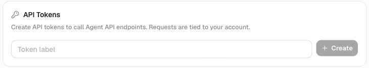
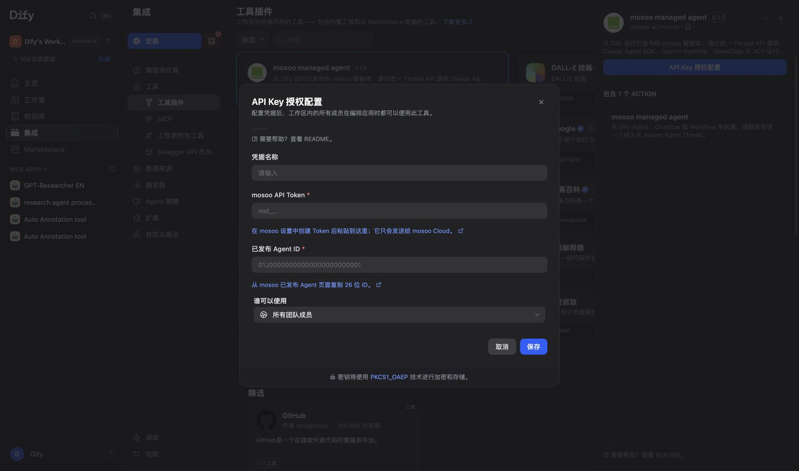
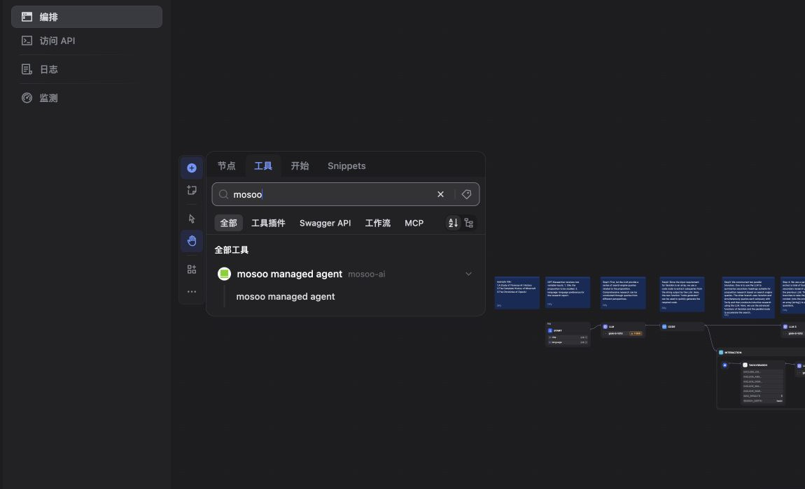

# mosoo managed agent for Dify

Run one published [mosoo](https://mosoo.ai) Agent as a native tool in Dify Agents, Chatflows, and Workflows. mosoo is the harness-neutral managed Agent runtime; Dify sends a task, and mosoo owns the configured model, tools, sandbox, memory, and execution lifecycle.

`Dify -> mosoo Thread API -> published Agent -> configured runtime + model`

## What you get

- One `mosoo managed agent` tool for starting, continuing, or waiting on a durable Thread.
- Canonical final output plus `thread_id`, `run_id`, `status`, and a public-safe error for Workflow branching.
- Recovery for long tasks: a timeout returns `thread_id`; call the tool again with that ID and no task.
- A fixed `https://cloud.mosoo.ai/api/v1` destination. The plugin never sends your token to a custom host.

## Setup

1. In [mosoo Cloud](https://cloud.mosoo.ai), add a model-provider key, create an Agent, test it, and publish it. Copy the 26-character Agent ID from the Agent list or settings.
2. Open **Settings -> Access tokens**, enter a label, click **Create**, and copy the `mst_...` token shown once.

3. In Dify, install **mosoo managed agent** from Marketplace. Before publication, upload the built `mosoo.difypkg` from **Plugins -> Install from local package**.
4. Configure the provider with the mosoo API token and published Agent ID. The credential check is read-only.

5. Add **mosoo managed agent** under an Agent's tools, or add a **Tool** node in a Chatflow/Workflow and select it.

## Use

| Goal              | `prompt` | `thread_id`  |
| ----------------- | -------- | ------------ |
| Start work        | Required | Empty        |
| Continue a Thread | Required | Prior output |
| Wait longer       | Empty    | Prior output |

`timeout_seconds` defaults to 120 (10-240). The tool maps the Dify runtime user to mosoo `userId` and refuses to continue a Thread owned by another Dify user. A `waiting_input` result means the Agent needs a permission or input resolved in mosoo; then call again with `thread_id` only.

## Supported runtimes

mosoo is a managed Agent runtime, not a Dify model provider. This plugin runs an already-published Agent; its runtime and model are configured in mosoo. Current public runtime choices are:

- **Claude Agent SDK** for Anthropic Claude models.
- **OpenAI Runtime** for OpenAI GPT models and custom OpenAI-compatible endpoints that implement the Responses API.
- **OpenCode** for Anthropic, OpenAI, DeepSeek, Gemini, Qwen, Kimi, Zhipu, MiniMax, OpenCode Zen, and custom OpenAI-compatible models.

Exact model availability depends on the provider keys configured in mosoo and the current [mosoo runtime catalog](https://github.com/langgenius/mosoo/blob/main/pkgs/runtime-catalog/catalog/runtime-catalog.jsonc).

## Security, privacy, and source

Tasks are sent to mosoo and may cause the configured Agent to use remote models, tools, MCP servers, network access, or sandboxed command execution. Review the Agent before publishing it. The plugin has no storage or analytics; see [PRIVACY.md](./PRIVACY.md).

Source: [mosoo-ai/dify-plugin-mosoo](https://github.com/mosoo-ai/dify-plugin-mosoo) · Docs: [mosoo.ai/docs](https://mosoo.ai/docs/) · Support: [GitHub issues](https://github.com/mosoo-ai/dify-plugin-mosoo/issues) · Contact: [cyefan2@gmail.com](mailto:cyefan2@gmail.com)
